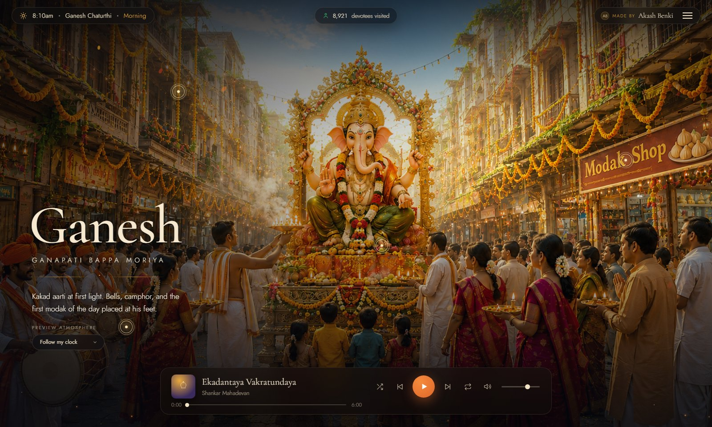
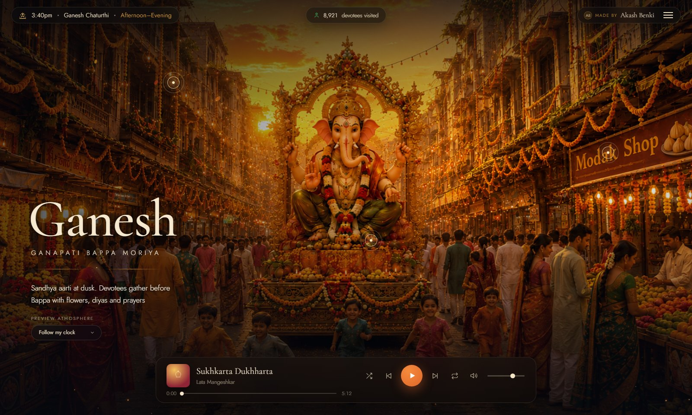
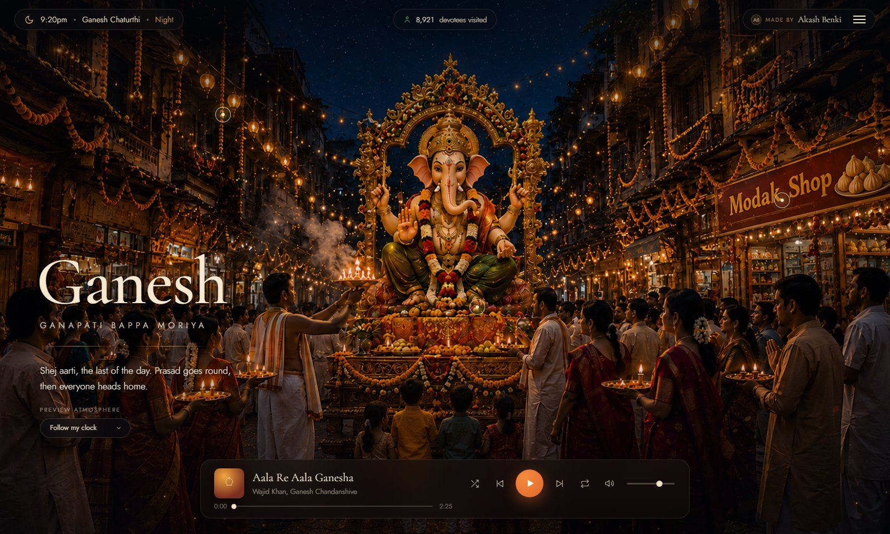
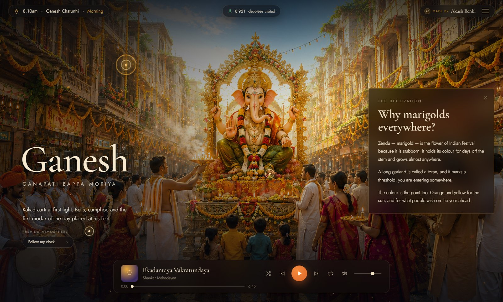
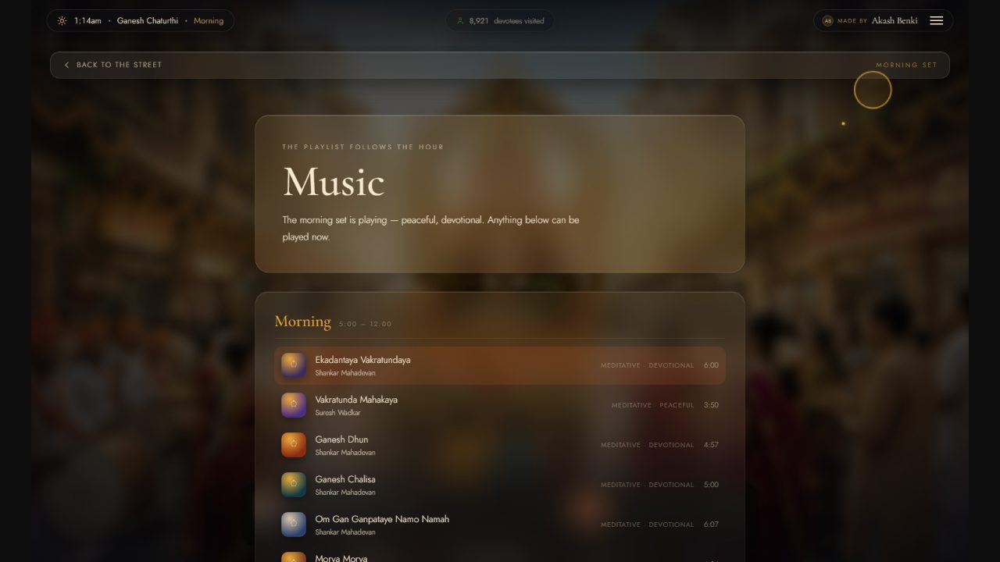
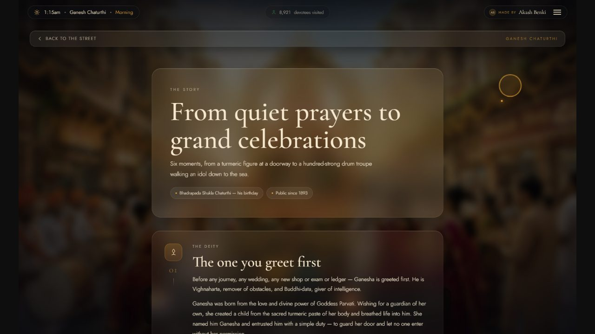
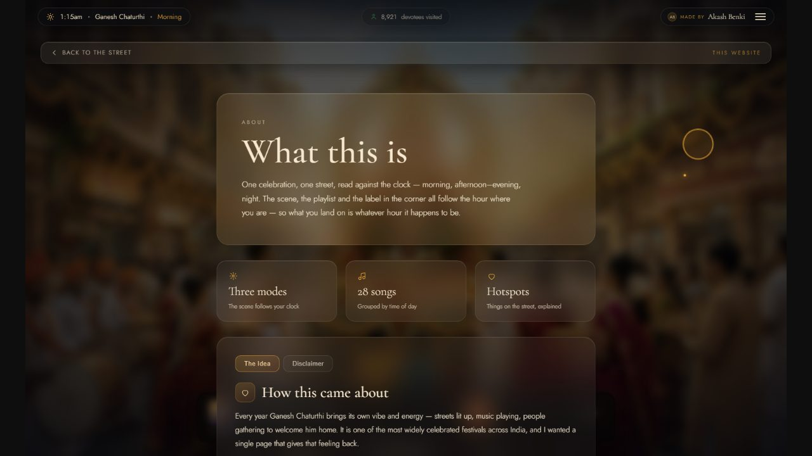

# Ganesh Chaturthi — Live

A single-page tribute to Ganesh Chaturthi: one festival street, staged as a living scene that changes with the time of day, carries a playlist that follows the hour, and hides little stories behind the things sitting on the street.

**[Live site →](https://ganesh-chaturthi-live.vercel.app)** *(update with your actual deployment URL)*



---

## What this is

- One street, rendered as a full-screen cinematic scene, that carries the music, the story of the festival, and small details about what's happening on it.
- The hour you open the site in decides everything: the lighting, the mood, the playlist, and the label in the corner.
- No sign-up, no clicking through pages by default — you land straight into the scene and everything unfolds from there.
- Built as a personal, non-commercial festival project — see [Credits & Disclaimer](#credits--disclaimer).

---

## The three atmospheres

The scene reads the visitor's local clock and switches between three moods automatically. A "Preview atmosphere" picker on the home screen also lets anyone jump between them manually, regardless of the real time.

| Morning (5am – 12pm) | Afternoon–Evening (12pm – 7pm) | Night (7pm – 5am) |
|---|---|---|
|  |  |  |
| Kakad aarti at first light — soft daylight, calm tones, the meditative/devotional playlist. | Sandhya aarti at dusk — warm sunset light, festive energy building. | Shej aarti, the last of the day — deep blue night sky, string lights, the most energetic/festive tracks. |

Each mode swaps the background artwork, the colour tint, the vignette, and the currently-playing song set — all driven by one `PHASES` config in [`src/data.js`](src/data.js).

---

## Interactive hotspots ("things on the street, explained")

Glowing pulse markers are pinned directly onto the scene artwork (they track the image, not the window, so they stay put at any screen size). Clicking one slides in a side panel explaining what that thing actually is and why it's there.



*Example above: clicking the marigold garlands over the street opens a panel titled "Why marigolds everywhere?" — explaining what `zendu` (marigold) symbolizes and why it's used as festival decoration (the `toran` garland, its colour, its durability).*

Other hotspots on the street include:
- **The modak stall** — why modak is the sweet most associated with Ganesha.
- **The offerings (naivedya)** — the fixed plate of modak, durva grass, hibiscus, coconut, jaggery and lamp placed before the idol, and the story behind the durva grass.
- **The dhol-tasha pathak** (morning only) — the drum troupe that sets the pace of the procession.

---

## Music tab

A full playlist experience, synced to the same day-part logic as the scene.



- Songs are grouped into **Morning / Afternoon–Evening / Night** sets (28 tracks total), each tagged with mood (devotional, festive, meditative, energetic…).
- Whichever hour you're in decides which set autoplays — pick any track manually and the site remembers you've "pinned" your own choice until you tell it to let the clock choose again.
- A hidden YouTube IFrame player drives real audio playback, with a full transport bar (play/pause, next/prev, shuffle, loop, volume, scrub) docked at the bottom of the screen at all times.

---

## The Story tab

The history of Ganesh Chaturthi itself, told as a scroll of numbered chapters.



Six chapters trace the festival from myth to modern day:
1. **The deity** — how Ganesha came to be, and why he's greeted first before any new beginning.
2. **The occasion** — what Ganesh Chaturthi actually celebrates, and why it falls when it does.
3. **Origins & patronage** — from a quiet household shrine to a festival backed by the Peshwas of Pune.
4. **1893: Tilak makes it public** — how Bal Gangadhar Tilak turned it into a public festival as a response to colonial-era assembly bans.
5. **The mandal** — how the neighbourhood committee became the heart of the modern celebration.
6. **Until we meet again** — the visarjan (immersion) that closes the festival, and the shift toward eco-friendly clay idols.

---

## About tab

The "why" behind the site — what it is, the stats behind it, the idea that sparked it, and a plain disclaimer about the music.



- **Three modes** — the scene follows your clock.
- **28 songs** — grouped by time of day.
- **Hotspots** — things on the street, explained.
- A short note on why the site was built, and links to a few other single-idea websites that inspired it.

---

## Other things worth knowing

- **Live devotee counter** — a small header pill shows a running count of visitors, backed by an Upstash Redis counter (see [`api/devotees.js`](api/devotees.js)); every page load increments it.
- **Responsive layout** — the header, hero text and player all reflow for narrow/mobile viewports, and hotspots hide themselves entirely on screens too small to show them cleanly.
- **Ambient effects** — drifting embers and falling petals layered over the scene, eased in and out on every phase transition.
- **Slide-out navigation** — a hamburger menu opens a full side panel with links to Home / Music / The Story / About, plus social links.

---

## Tech stack

- **[React 18](https://react.dev/)** + **[Vite](https://vitejs.dev/)** — front end and dev/build tooling.
- Plain CSS-in-JS (inline styles) — no CSS framework.
- **YouTube IFrame API** — audio playback for every track.
- **[Upstash Redis](https://upstash.com/)** — serverless key-value store backing the devotee counter.
- **[Vercel](https://vercel.com/)** — hosting, with a serverless function at `api/devotees.js`.

---

## Running it locally

```bash
npm install
npm run dev       # starts the Vite dev server
npm run build      # production build
npm run preview     # preview the production build locally
```

The devotee counter needs Upstash Redis credentials (`UPSTASH_REDIS_REST_URL` / `UPSTASH_REDIS_REST_TOKEN`) in a `.env.local` file to work; without them it falls back to a static seed count.

---

## Credits & Disclaimer

This website is built purely for non-commercial purposes — to collect and play Ganesh songs in one place for the festival. All credit for the music belongs to the original singers, composers, lyricists and labels. No copyright or ownership is claimed over any of the songs; they are embedded here only in celebration of the festival, and will be taken down on request from a rights holder.

Made with Ganesh Bhakthi by **[Akash Benki](https://www.linkedin.com/in/akash-a-benki/)**.
